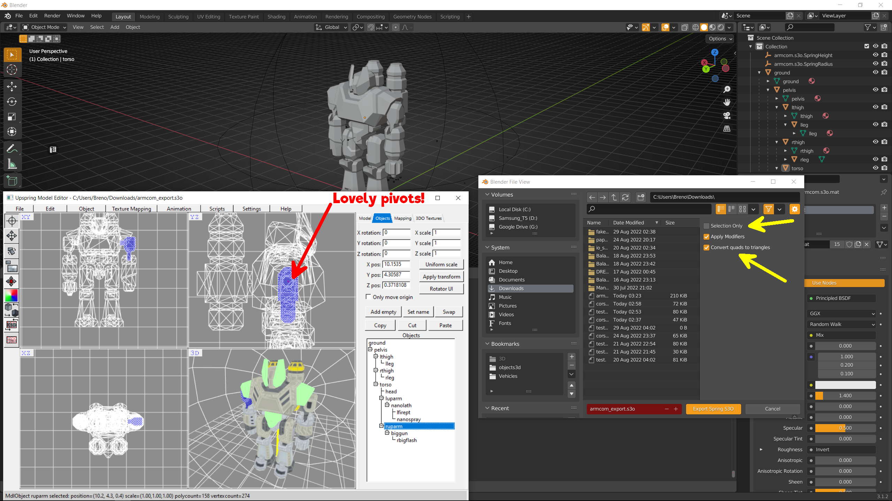
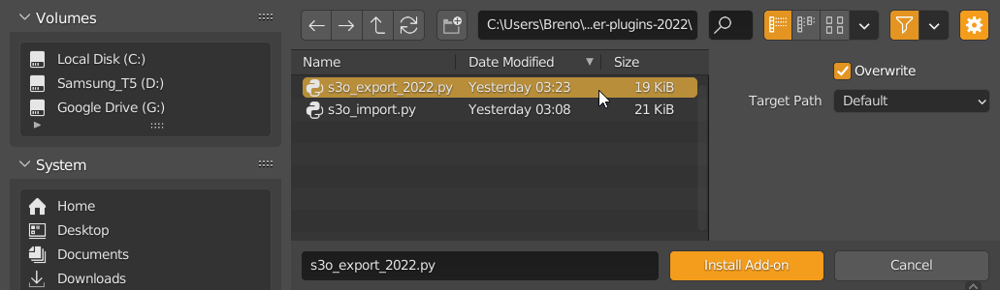
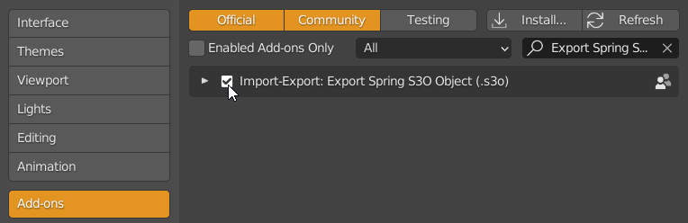
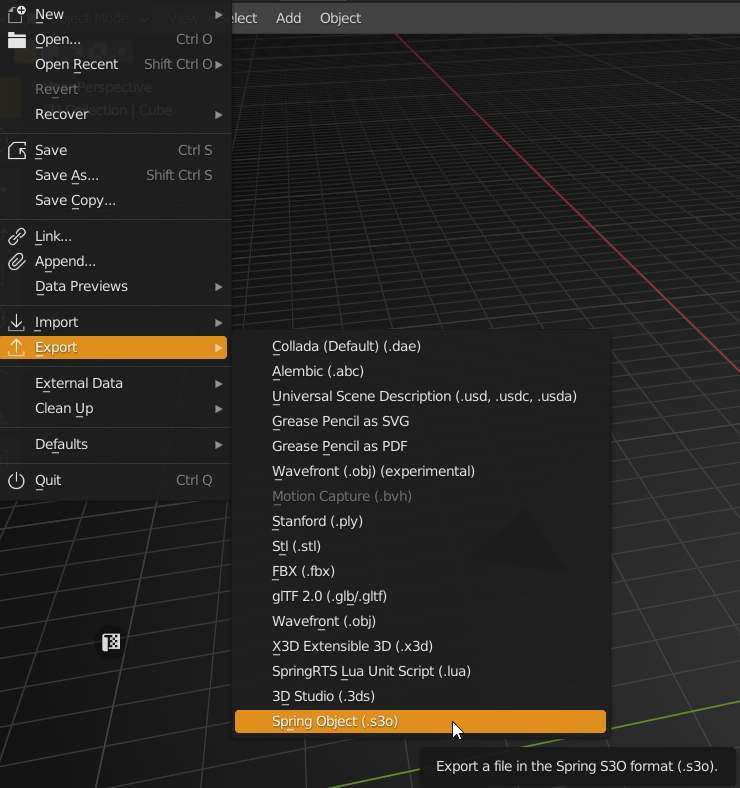
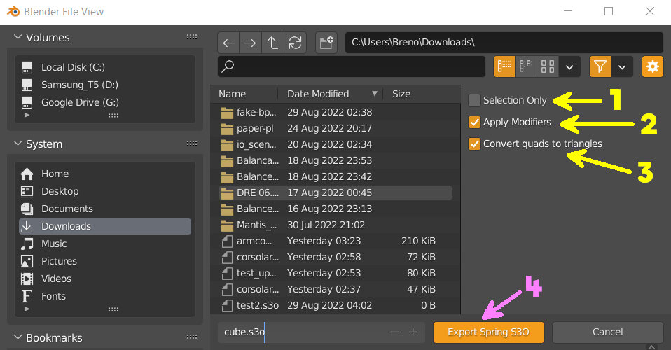
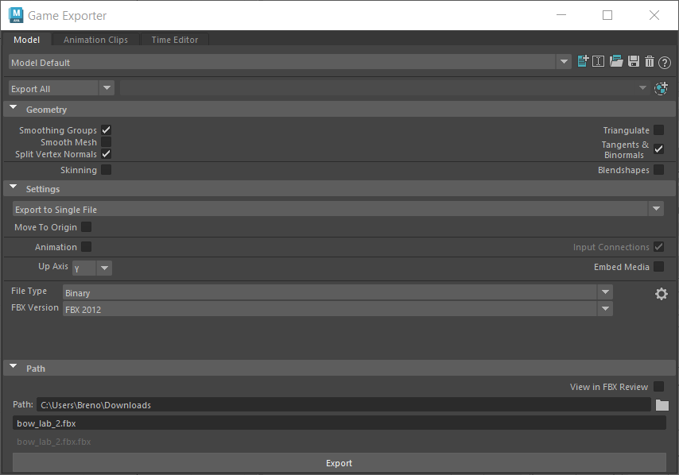

# s3o-Blender-plugins-2022

Blender s3o scene/mesh exporter for the SpringRTS engine, compatible with Blender 3.x

## What is s3o?
[Spring 3D object](https://springrts.com/wiki/About_s3o), a binary file optimized for usage in the open-source [SpringRTS](https://springrts.com/) engine and its forks, like the [SpringBAR](https://github.com/beyond-all-reason/spring) engine.

## Why should I use s3os, and what's this tool about?

Although SpringRTS does support .dae and other open 3d formats, the best object shaders (with features like vertexAO, HDR-like shading and scrolling textures for vehicle tracks) are only available for s3os. Unfortunately the only Blender plugins available to import/export this format are from 2008 and haven't been updated to run on Blender 2.8+ - except for the importer, recently updated by SanguinarioJoe. Although it was already possible to load/save a model, preserving its existing hierarchy and pivot points, to/from Blender using [obj2s3o](https://github.com/beyond-all-reason/OBJ2S3O), having to rely on the native s3o 3D editor, Upspring, for the placement of pivots was always inaccurate and shaky to say the least. With a proper s3o exporter, it's possible to bring model hierarchies set up in any 3d program to Spring, swiftly and accurately, dismissing any intermediary steps.

## Install and Usage Instructions:

1. Open up the preferences panel (menu Edit > Preferences)
2. Select the tab "Add-ons" at the middle left column and click on "Install" at the top right of the panel
3. Navigate to the folder you've downloaded or cloned s3o_export_2022.py. Select it and click on 'Install Add-on" at the bottom

4. Tick the toggle to the left of the just-imported add-on, to enable it

5. To export the objects in the scene, go to the menu File > Export, then select the "Spring Object (.s3o)"

6. Once the File selection window open, you may toggle one of the options/properties to the right:
	1. "Selection Only" - exports a single selected object in the scene. Currently it won't export the children hierarchy.
	2. "Apply Modifiers" - applies any object modifiers present in the scene, like 'mirror' or 'array'.
	3. "Convert quads to triangles" - what the name says.
	4. "Remove name-clash suffixes" - Redundant Blender object names like "wing.001" will be exported as "wing" 
  

7. Finally, enter a name and click on the "Export Spring S3O" button to generate and save the file. 

## Attention:
Currently the s3o exporter carries out destructive operations. That means "Apply Modifiers" and "Convert quads to triangles" will not be undone, so make sure to keep a backup. 

## s3o object radius and height:
These s3o specific parameters may be defined in the Blender scene with two empty objects. Their names must be (or include) "SpringHeight" and "SpringRadius", with the first being set to "Arrows" display mode and the second to sphere display mode. The vertical (z in Blender) position of the "SpringHeight" object will define the object height, and should always be above the top-most point of the mesh - the Arrows size there is disregarded, set it as you wish. As for the "SpringRadius" empty, its position and display size will define the center and radius of the outer collision sphere to be assigned to the model in-game.

## Baking rotations and scales
The s3o exporter bakes (applies) rotation and scale into all objects for you, starting from the root piece. That's a destructive operation, so even with all export options unticked, this one is required and will be performed, so remember to backup your Blender scene before export. It's worth noting that sometimes during tests, pieces at the end of the hierarchy would not get its transformations applied properly - so if you run into hierarchy position errors when opening the model in UpSpring, try doing "Apply Scale and Rotation" manually in Blender before export, with the offending objects selected.

## Auto-edge-split by UV islands
Since version 0.6.1, the s3o exporter also automatically splits the polygons across UV island edges. That is necessary to prevent UV corruption in the s3o, due to the shared UV-indexes system used by Blender. Please notice that's another destructive operation, so once again, make sure to backup the original file before exporting the s3o.

## s3o importer (s3o_import.py): 
The included version of the s3o importer is slightly modified from the one present in the [Skeletor](https://github.com/Beherith/Skeletor_S3O) plugin, by Beherith. This version adds support for no-geometry s3o objects (like empties) and parents all imported objects to a single collection. This might pose some challenge for certain names, so feel free to use Skeletor's version if you prefer. To install it, follow the same steps outlined at the "Install and Usage" section above.

## Coordinates System:
s3o-export-2022 only exports to the Y-up, Z-forward axis convention used by [UpSpring](https://github.com/SpliFF/upspring) (native s3o model editor) and the SpringRTS engine. The importer automatically converts the coordinates to the Z-up, Y-forward axis convention used by Blender, so the roundtrip of a model should be straightforward.

## Remarks:
* Try to clean up your scene from any extraneous objects, like lights and cameras. They might interfere with the detection of the scene-root gameobject
* Texture naming is not currently being exported. It was quite a hassle to setup in the 2008 version, while it's super-easy to assign the texture names in Upspring or Beherith's excellent obj2s3o tool. 
* Talking of obj2s3o, it has an optimize option for .s3o files, which is also ran when you apply vertex-AO or do other processing there. 
* Remember to have a single parent for all objects in the scene.
* Whenever possible, try to first import an existing s3o as a basis for your work, it'll set up the SpringRadius and SpringHeight objects for you fast and easy. If those objects aren't found, the exporter will simply assign some default values, you may update them later in Upspring.
* If you're importing your model from Maya, make sure to NOT export this using the default FBX exporter. It ruins the UVs and that's not readily apparent in Blender, it's only clear when you open the s3O model in UpSpring or in-game. Use the "Game Exporter" option, set it to Binary/FBX2012 (newer versions might work too, untested), like below:

## Support:
Besides the "issues" section here in Github, please join the TAP (WIP RTS game, Total Atomic Power) Discord, #tools channel to get the fastest possible support. Here's the invite/link: [https://discord.gg/XhhBaZZ](https://discord.gg/XhhBaZZ)

## Issues and Bug Reporting:
If you run into any errors, make sure to report the error messages you got and, if possible, a repro .blend file. The processing details and any export errors will be printed on the console. On Windows, you may activate the console with the "Window > Toggle System Console" option. If you're using the plugin on a non-Windows OS, Google for instructions on how to run Blender with the console enabled. As usual, feel free to submit PRs for any relevant improvements or bugfixes you decide to tackle yourself.

And.. Enjoy! ^_^

###### Authors: Breno 'MaDDoX' Azevedo, Jez Kabanov (original 2008 exporter)
###### Special Thanks: [Anarchid](https://github.com/Anarchid), [SanguinarioJoe](https://github.com/sanguinariojoe/) (s3o-importer update to Blender 2.8+), [Beherith](https://github.com/Beherith/)
